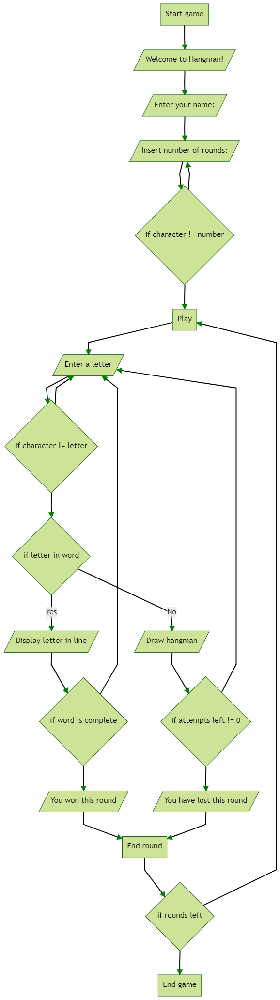
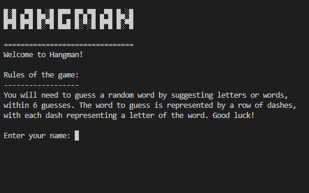
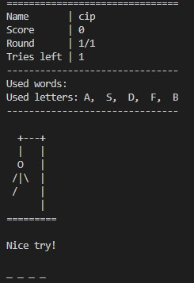
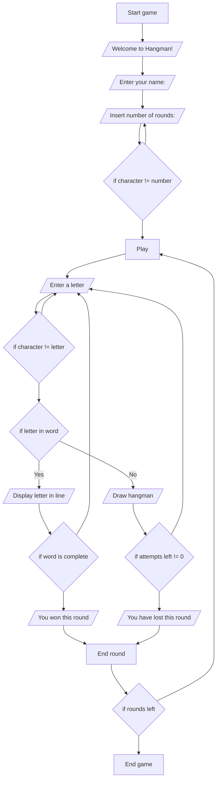

# Hangman

Hangman is a Python command-line game, after the classic paper and pencil guessing game.

Users try to guess a word suggesting letters and words, within six tries. The word to guess is represented by a row of dashes.

[The live version of the project can be accessed here.](https://antocim-hangman.herokuapp.com/)

## How to play

This version is based on the same rules as the traditional game. More about game history and rules, can be found on [Wikipedia](https://en.wikipedia.org/wiki/Hangman_(game)).

In this version, the player introduces his name and a chosen number of rounds between 1-10.

A raw of dashes will arise representing each letter of a random word to be guessed, within 6 tries.

The player can introduce letters or words until out of tries or the word is guessed. 

Game progress will be displayed all the time, represented by score, round number, lists of used letter and words.

Graphically, each new body part of the Hangman simbolyse an inccorect input.

## Features

The game is following this flow diagram:

### Existing Features

- User input:
    - Every input user is validated and error checked.
    - In the initial phase user is allowed to pick its name and the number of rounds.
    - Allows the user to insert single letters and full words.
    - Letters and words are not case sensitive.

- ASCII art was used to improve the visual aspect of the game.

- Dashboard
    - The game continuously updates the user about the progress via the dashboard. It contains information about score, tries left, current round number, used letters and used words.
    - Has the classic hangman darwing which updates based on tries.
    - Has an incremental display of the secret word.
    - The player cannot see the entire word until a correct guess is made or game over.

- User feedback messages like "Nice try!" and "That's right!".

- Terminal is frequently clreared to keep the game in players focus.

- One randomly selected word per round.

- Play against computer.

- Possibility to start a new game exsiting the game.

- Possibility to change easily change the word bank, by adding/replacing text into the `words.txt` file.

- No external or third-party dependencies.

### Future features
- Add 2-player mode, where one `user1` introduces the word, while `user2` guesses. If `user2` guesses its score goes up by one point, otherwise `user1`'s score goes up.
- Add multiple difficulty levels.
- Add possibility for user to choose the of words from which to choose.
- Refactor the game to use classes.

## Testing
I have tested the code manually by:
- Frequently linting the code using PEP8 and Pylint linters. Errors have been detected and I fixed them incrementally. Refer to [this page](docs/test.md) for more details.
- Trying inputs that are close to the extremes:
    - since `round` is restricted between 1-10, I tried playing 1, 5 and 10 rounds. Everything outside this range was reported invalid by the game. 
    - when guessing I inserted both uppercase and lowercase characters.
    - when guessing I inserted both characters between [a-z], but also numbers, punctuation signs and special characters.

## Bugs

### Solved bugs
- Used letters allowed dupplicated values if the user selected the same wrong charather twice. Solved by checking if the character is already in the list before appending it.
- Sometimes words with punctuation were randomized from the file, which creates imposibility to win. Solved by removing the punctuation in the text file.
- The case sensitive was making the game impossible to win. I removed this sensitivity by converting both the randomized word and user inputs to uppercase.
- Because of the `clearing` terminal approach, the end of round display was not visible to the user, because the next round would start. This bug was visible only when number of rounds was bigger than one. I solved this by asking the user to press any key to start a new round. This was the revealed secret word can be seen.

### Open bugs
- None

