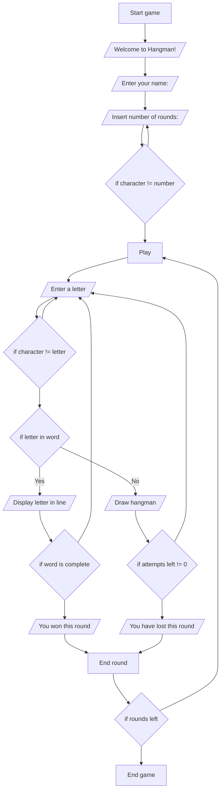

```mermaid
graph TD 
    A[Start game] -->A0[/Welcome to Hangman!/]
    A0 --> A1[/Enter your name:/]
    A1 --> A2[/Insert number of rounds:/]
    A2 --> A3{if character != number}
    A3 --> A2
    A3 --> A4
    A4[Play] --> B[/Enter a letter/]
    B --> b1{if character != letter}
    b1 --> B
    b1 --> b2{if letter in word}
    b2 -- Yes --> D[/Display letter in line/]
    b2 --No --> E[/Draw hangman/]
    E --> F{if attempts left != 0}
    F --> B
    F --> G[/You have lost this round/] 
    D --> H{if word is complete}
    H --> B
    H --> J[/You won this round/] 
    J --> K[End round]
    G --> K 
    K --> L{if rounds left}
    L --> A4
    L-->M[End game]
    
    
```