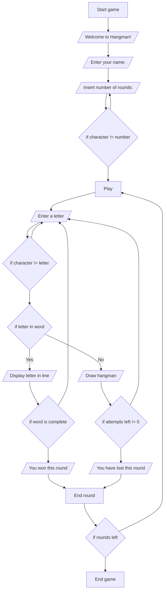

# Hangman

Hangman is a Python command-line game, after the classic paper and pencil guessing game.

Users try to guess a word suggesting letters or words,
within 6 guesses. The word to guess is represented by a row of dashes.

[The live version of the project can be accessed here.](https://antocim-hangman.herokuapp.com/)

## How to play

This version is based on the same rules as the traditional game. More about game history and rules, can be found on [Wikipedia](https://en.wikipedia.org/wiki/Hangman_(game)).

In this version, the player introduces his name and a chosen number of rounds between 1-10.

A raw of dashes will arise representing each letter of a random word to be guessed, within 6 tries.

The player can introduce letters or words until out of tries or the right word is guessed. 

Game progress will be displayed all the time, represented by score, round number, lists of used letter and words.

Graphically, each new body part of the Hangman simbolyse an inccorect input.

