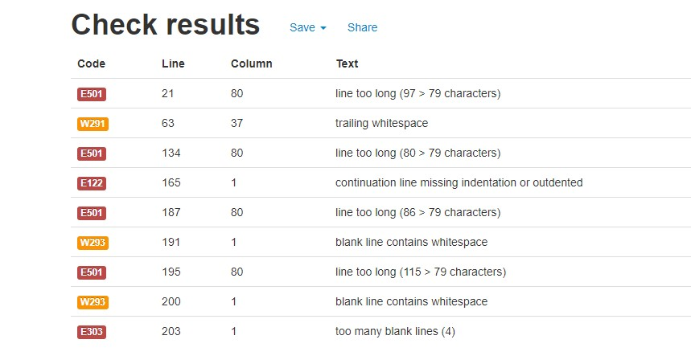
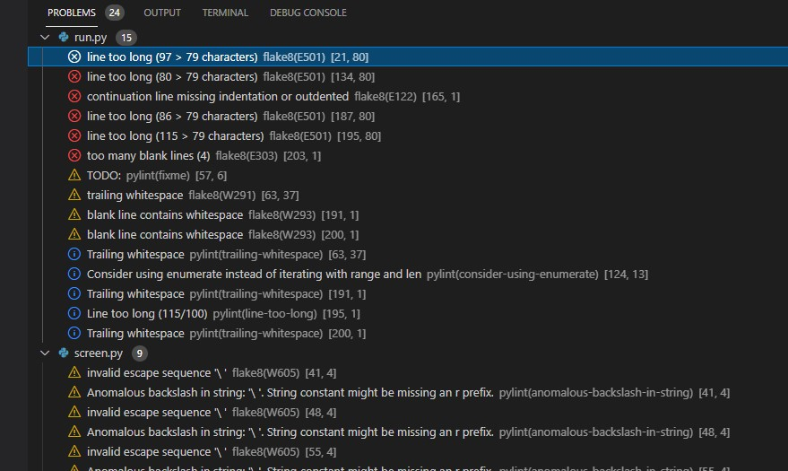

# Fixing error and warrnings

 During development process some errors and warnings arose in PEP8 linter, as well as in Vs command-line, problems section. Errors have been fixed during various stages. 
 
 1. The following [commit] (https://github.com/AntociM/hangman/commit/88e8ae0e32d8563a18cf7efad87d4ad387c76d27) documents the first testing and fixing process. 
 
 

 

 2. This [commit](https://github.com/AntociM/hangman/commit/cbb4d7bcab9d025ef33ded7d06368381bc49cf4e) documents the main problems that occured during develpment proces.

 

 
